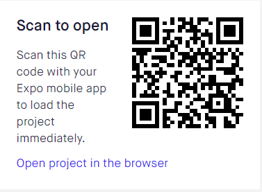

## Final Project in 02808-Personal Data Interaction for Mobile and Wearables

This app is the app we used for the final project in the course 02808-Personal Data Interaction for Mobile and Wearables. It's a prototype where you can add your physical training exercises, rate the exercises and log how much water you drink to see if there is any correlation between your rating of the exercise and how much water you drink.

The app is made by Matz-Leander Solheim Wiik and Fei Xie.

## Installation Instructions
To install the app on your device, simply follow these steps:
### Install on Android
* Install [Expo](https://play.google.com/store/apps/details?id=host.exp.exponent&hl=en_US) on your Android device.
* Open the Expo app and scan this QR code when prompted.<br/>
 
* Congratulations. You shoul be able to run the app now!

### Install on iOs
* Make sure you have [Node](https://nodejs.org/en/) or npm installed on your computer 
* Register a user on [Expo](https://expo.io/).
* Open your command line and run this code ```npm install exp --global```
* Do a git pull on this project
* Open your command line again and ``` cd 02808_final_project ```
* Run ``` npm install ```
* Run ``` exp start ```
* Download the [Expo](https://itunes.apple.com/us/app/expo-client/id982107779?mt=8) client on your iOs device and log in to your Expo user. You should now be able to open the project.
